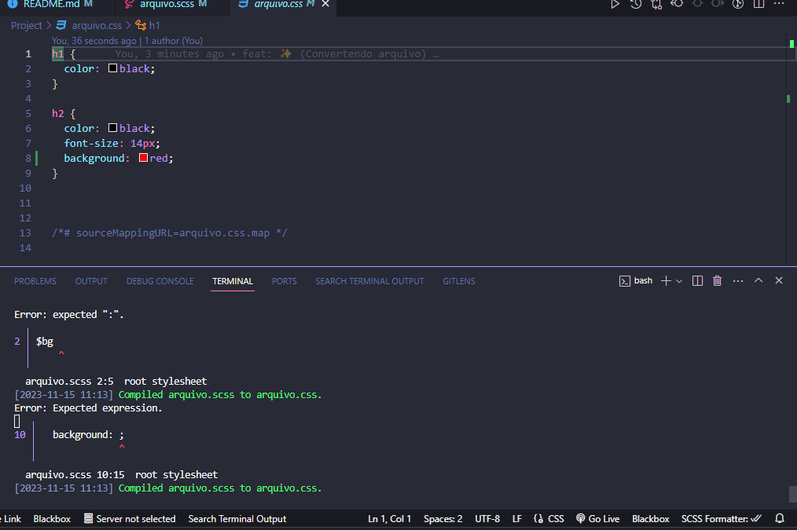
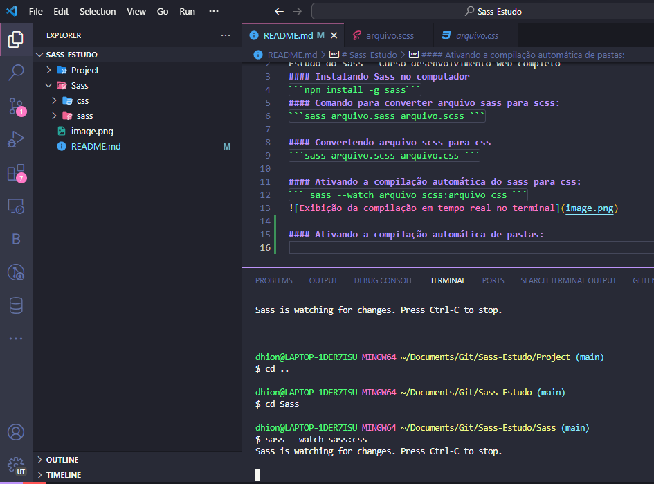

# Sass-Estudo
Estudo do Sass - Curso desenvolvimento web completo
#### Instalando Sass no computador
```npm install -g sass```
#### Comando para converter arquivo sass para scss:
```sass arquivo.sass arquivo.scss ```

#### Convertendo arquivo scss para css
```sass arquivo.scss arquivo.css ```

#### Ativando a compilação automática do sass para css:
``` sass --watch arquivo scss:arquivo css ```


#### Ativando a compilação automática de pastas:
```sass --watch sass:css```
